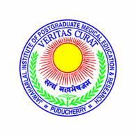

<%
    def list2enum(lst):
        """convert items in python list to enumerated list"""
	return ''.join(['\n\t#. ' + x for x in lst])	
%>

<%
    def list2bullet(lst):
        """convert items in python list to bullet list"""
	return ''.join(['\n\t- ' + x for x in lst])	
%>

|jipmer|  Electrophysiology study and RF ablation
=================================================

Department of Cardiology
------------------------

Jawaharlal Institute of Postgraduate Medical Education and Research
--------------------------------------------------------------------

.. csv-table:: Demographics

          "**Name**", "${vals['patient_name']}", "**Age**", "${vals['patient_age']}", "**Sex**", "${vals['patient_sex']}"
	  "**Date of Admission**", "${vals['admission_date']}", "**Hospital No.**", "${vals['hospital_number']}", "**IP No.**", "${vals['ip_number']}"

Summary
'''''''
"${vals['summary']}

.. csv-table:: Clinical
   :widths: 3, 10

    "**Presentation**", "${vals['presentation']}"
    "**ECG**", "${vals['ecg']}"
    "**ECG during tachycardia**", "${vals['ecg_tachycardia']}"
    "**Other investigations**", "${vals['other_investigations']}"
    "**Drugs**", "${list2enum(vals['drugs'])}"

.. csv-table:: Technical details
   :widths: 3, 10

    "**Lab**", "${vals['lab']}"
    "**EP System**", "${vals['ep_system']}"
    "**Stimulator**", "${vals['stimulator']}"
    "**Operators**", "${list2bullet(vals['operators'])}"
    "**Comment**", "${vals['technical_comment']}"

.. csv-table:: Access and catheters
   :widths: 3, 10

    "**Access**", "${list2bullet(vals['access'])}"
    "**Catheters**", "${list2bullet(vals['catheters'])}"

% for m in vals['pre_measurements']:
   <%include file="measurements.rst" args="mvals=m"/>
% endfor

% for m in vals['tachycardias']:
   <%include file="tachycardia.rst" args="mvals=m"/>
% endfor

.. csv-table:: RF ablation
    :widths: 3, 10

    "**Ablation catheter used**", "4 mm tip Webster Blue"
    "**Target**", "Anatomical - at level of CS os / Slow pathway potential"
    "**Settings**", "60 C / 30 W"
    "**Ablation time**", "2 / 60 seconds"
    "**Endpoint**", "No AH jump / Non inducible"

% for m in vals['post_measurements']:
   <%include file="measurements.rst" args="mvals=m"/>
% endfor

Conclusions
'''''''''''
"${list2bullet(vals['conclusions'])}"

Recommendations
'''''''''''''''
"${list2bullet(vals['recommendations'])}"

.. raw:: pdf

       Spacer 0 40
     
    
| **Dr. Raja J. Selvaraj**
| **Department of Cardiology**
| **JIPMER**

      

     

.. footer::

   EP report  Pg.###Page###
	      
	     
